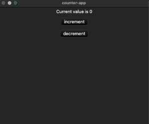

# GUI counter with rust

Using [druid](https://github.com/linebender/druid)

Reference version is the latest version as of September 5, 2022.

It did not work with the released `0.7.0`.

# Usage

```shell
$ cargo run
```

# Image


